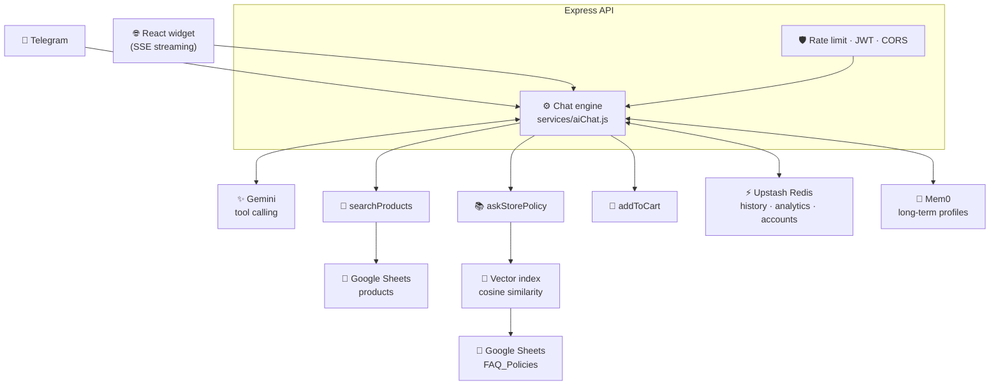

# 🤖 TechStore — Omnichannel AI Sales Agent

An AI customer-support and sales agent for an e-commerce store, reachable from **both a Telegram bot and a web chat widget**, sharing one engine, one memory and one product catalogue.

The store's owner edits a **Google Sheet** — products, prices, stock, FAQ, return policy. The agent picks the changes up automatically. No deploy, no CMS, no developer.

**[▶ Live demo](https://telegrambot-frontend.onrender.com)** · 💬 Telegram bot: `@Assistant_Sandbox_bot` — ⚠️ **TODO: replace with your real bot handle and link it as `https://t.me/<handle>`**

> Hosted on Render's free tier, which sleeps after 15 minutes of inactivity — the first request may take ~50 seconds to wake the service. Subsequent requests are fast.

---

## Why this project is interesting

Most chatbot demos are a single prompt wrapped in a UI. This one is built the way a paying client's system has to be built:

* **It refuses to make things up.** Policy questions are answered from a vector search over the store's own FAQ sheet, never from model knowledge.
* **It answers in the customer's language** while the product database stays English — queries are translated before lookup, and retrieved policies are translated back.
* **It survives its dependencies failing.** Redis down, a model unavailable, the Sheets API blipping — each has an explicit fallback rather than a 500.
* **It knows what it costs.** An admin dashboard reports token spend per model, per day.

---

## ✨ Features

| | |
|---|---|
| 🔀 **Omnichannel** | One engine serves the Telegram bot and the website widget. Add a channel by adding an adapter, not by forking the logic. |
| 🔎 **Live inventory search** | The agent queries real stock and pricing mid-conversation via tool calling, with a 30-second cache and request de-duplication. |
| 📚 **RAG over Google Sheets** | Policies are embedded with `gemini-embedding-001` (3072-dim) and retrieved by cosine similarity. **The client edits a spreadsheet; the agent's knowledge updates.** |
| 🧠 **Long-term memory** | [Mem0](https://mem0.ai) extracts durable facts about each customer ("prefers Android", "budget around $800") and personalises later conversations. |
| 🗣️ **Multilingual** | Replies in the customer's language automatically. Policy-trigger terms and brand-voice rules are configured per locale, not hardcoded. |
| 🖼️ **Multimodal** | Accepts photos and voice notes on Telegram, and image uploads on the web. |
| 🛒 **Agentic cart control** | The agent sees the customer's cart and can add to it, remove from it or empty it, through a structured action channel rather than by guessing at the DOM. |
| 🧑‍💼 **Full admin console** | Product create/edit/delete written straight to Google Sheets, plus analytics, cost tracking, memory inspection and live service health. |
| 🔐 **Authentication** | JWT accounts with scrypt password hashing; signed-in users get a persistent, personalised thread. |
| 📊 **Admin analytics** | Chats, unique sessions, top questions, tool usage, token spend and a 7-day timeline. |
| 🛡️ **Production hardening** | Rate limiting, server-side session binding, prompt-injection sanitisation, fail-closed admin auth, graceful shutdown. |
| ♻️ **Model fallback** | Cascades through a configurable model chain and remembers the one that worked. |

---

## 🏗️ Architecture



**How a policy question is answered**

1. Customer asks about returns — in any language.
2. Gemini calls the `askStorePolicy` tool rather than answering from memory.
3. The query is embedded and matched against the pre-embedded FAQ sheet by cosine similarity.
4. Below the similarity threshold, the agent says it doesn't know instead of inventing an answer.
5. Above it, the matched policy is returned to the model, which phrases it naturally in the customer's language.

---

## 🛠️ Tech Stack

**Backend** — Node.js · Express 4 · Telegraf 4 · `@google/genai` · Upstash Redis · Mem0 · Google Sheets API · JWT · Jest + Supertest

**Frontend** — React 19 · Vite 6 · Tailwind CSS 4

**Infrastructure** — Docker · GitHub Actions CI · Render

---

## 📂 Project Structure

```text
backend/
├── index.js              # Bootstrap: server, bot launch, graceful shutdown
├── app.js                # Express assembly (exported for tests)
├── config/
│   ├── index.js          # Env loading, validation, all tunables
│   └── locales.js        # Per-market policy triggers and brand voice
├── lib/                  # redisClient · lruCache · keyedMutex · password · sessions
├── middleware/           # auth · rateLimit · errors
├── routes/               # products · auth · admin · chat
├── services/
│   ├── aiChat.js         # Core engine, shared by web + Telegram
│   ├── ragService.js     # Vector RAG over Google Sheets
│   ├── googleSheets.js   # Catalogue reader, cached and de-duplicated
│   ├── chatHistory.js    # Redis history + bounded in-process fallback
│   ├── memoryService.js  # Mem0 wrapper
│   └── analytics.js      # Usage counters and cost estimation
├── bot/telegram.js       # Telegram adapter
└── tests/                # 85 tests

frontend/src/
├── App.jsx               # Storefront
├── lib/api.js            # Single source of truth for API access
└── components/           # AIChatWidget · AdminDashboard · AuthModal · Cart · Navbar
```

The rule that keeps this from collapsing back into one file: **routes never talk to Redis, Gemini or Mem0 directly.** They validate input, call a service, and shape a response.

See [`backend/ARCHITECTURE.md`](backend/ARCHITECTURE.md) for storage trade-offs, scaling limits and the known-issues list.

---

## 🚀 Running Locally

**Prerequisites** — Node.js 18+, a [Gemini API key](https://aistudio.google.com/apikey), and a Telegram bot token from [@BotFather](https://t.me/botfather). Redis, Mem0 and Google Sheets are optional: without them the app runs in a degraded but functional mode.

```bash
git clone https://github.com/voodude2/telegramBot.git
cd telegramBot/backend
cp .env.example .env     # then fill in the values
npm install
npm run dev
```

```bash
cd frontend
npm install
npm run dev              # http://localhost:5173
```

For local development set `FRONTEND_URL=http://localhost:5173` in `backend/.env`.

### Configuration

Every variable is documented in [`backend/.env.example`](backend/.env.example). The ones that matter most:

| Variable | Notes |
|---|---|
| `JWT_SECRET` | **Required in production** — the app refuses to start without it. |
| `FRONTEND_URL` | Exact browser origin, no trailing slash. **Wildcards are refused in production.** |
| `ADMIN_API_KEY` | Guards `/api/admin/*`. Unset in production ⇒ admin routes return 503 (fails closed). |
| `GEMINI_MODELS` | Fallback chain, tried in order. |
| `SUPPORTED_LOCALES` | Markets to tune guardrails for, e.g. `en,ka`. |

### Testing

```bash
npm test        # 85 tests
npm run lint    # parses every source file
```

---

## 📡 API

| Method | Endpoint | Auth | Description |
|---|---|---|---|
| `GET` | `/healthz` | — | Liveness probe with dependency status |
| `GET` | `/api/products` | — | Live catalogue |
| `GET` | `/api/products/:id` | — | Single product |
| `POST` | `/api/products/refresh` | Admin | Force a cache refresh |
| `POST` | `/api/auth/register` · `/login` | — | Returns a JWT |
| `GET` | `/api/auth/me` | User | Current user |
| `GET` | `/api/chat/session` | — | Issue a signed anonymous session |
| `POST` | `/api/chat` | Optional | **Streaming chat (SSE)** |
| `POST` | `/api/auth/logout-all` | User | Revoke every session for the account |
| `GET` | `/api/admin/stats` · `questions` · `costs` · `timeline` | Admin | Analytics |
| `GET` | `/api/admin/health` | Admin | Dependency status and configuration |
| `GET`/`POST` | `/api/admin/products` | Admin | List with summary · create |
| `PATCH`/`DELETE` | `/api/admin/products/:id` | Admin | Update · delete |
| `GET`/`DELETE` | `/api/admin/memories` | Admin | Inspect or clear long-term memory |
| `POST` | `/api/admin/rag/refresh` | Admin | Re-index the policy sheet |

Product writes go to the same Google Sheet the AI reads, so the service account
needs **Editor** access on the spreadsheet — Viewer is enough for reads and will
fail writes with a clear 403.

Chat sessions are resolved **server-side** from the bearer token or an HMAC-signed anonymous id. A client cannot read another user's conversation by supplying their session id.

---

## ☁️ Deployment

Backend as a Render Web Service (root directory `backend`, or use the provided `Dockerfile`); frontend as a Static Site with `VITE_API_URL` pointing at the backend.

Pushing to `main` runs the test suite in GitHub Actions and triggers both deploys only if it passes.

> During a zero-downtime deploy you may briefly see a Telegram `409 Conflict` as the old instance releases its polling connection. The bot retries automatically.

---

## 📄 License

MIT — see [LICENSE](LICENSE).
